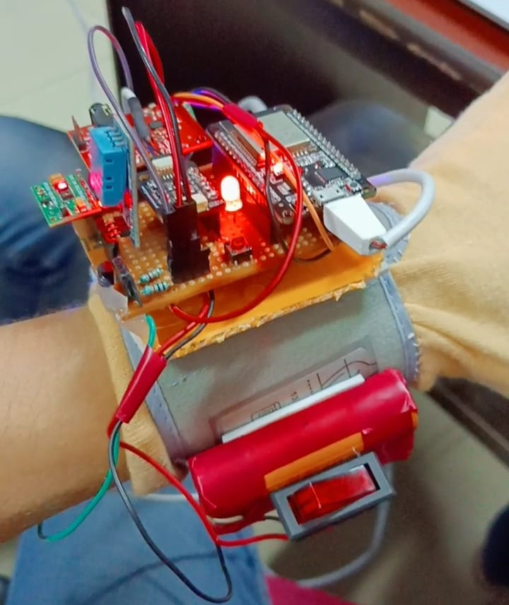

# Internet of Medical Things (IoMT)

## Project title: Remote Health Monitoring System

### Abstract: 
Remote patient monitoring technologies are becoming more significant and a future requirement in today's field of medical science, particularly after the COVID-19 situation, when patients wish to be kept isolated. A good monitoring system that measures vital medical indicators such as heart rate, oxygen saturation or SpO2, body temperature, blood pressure, ecg, etc. would be beneficial to patients. Our design is a power-efficient, wearable medical equipment as well as a resource-aware fog network to manage Internet of Things (IoT) data traffic in this project. The concept behind the design is to handle data from vital medical sensors in fog nodes located at the network's edge. The information gathered is utilised to develop a machine learning-based solution for personal health anomalies and COVID-19 infection risk assessment.

### Tools & Technologies Used:
1. Message Queue Telemetry transport (MQTT)
2. Apache Cassandra
3. Hostapd
4. Open Virtual Switch
5. Ryu-SDN Controller

### The Hardware Architecture:
The sensor layer consists of ESP32 and the individual sensors integrated on a pcb veroboard. At first, the ESP32 emits its hotspot which can be detected on a mobile or a desktop through which it is connected to the network from the raspberry pi. We use the autoconnect library for the dynamic setup of joining a WLAN with the appropriate SSID and PSK. It’s an Arduino library that includes the WebServer class for the ESP32 which helps to connect to the access point via the web interface at runtime, without the need for a hard-coded SSID and password. The data is transferred to the ESP32 via UART, I2C communication protocols, etc. and using MQTT protocol the sensor data is sent from ESP32 to the broker at the fog controller. The gathered data is then utilised to create a machine learning model that can forecast a person's medical issues. 

### Work under progress:

### Glove Working Model:

### Output in database:

